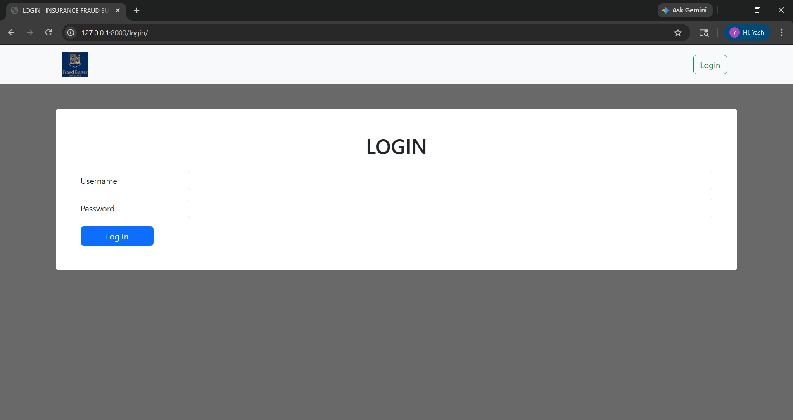
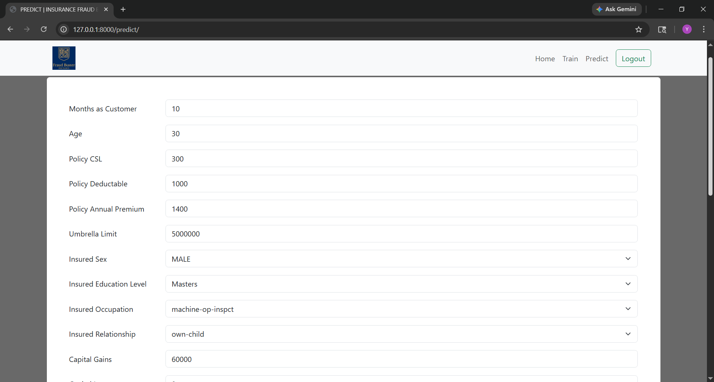
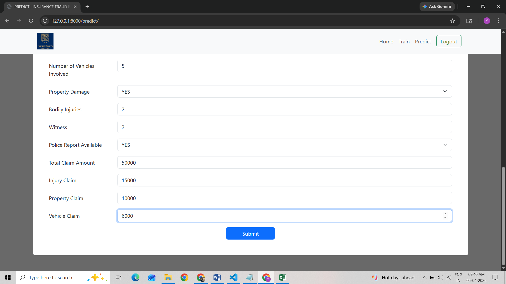
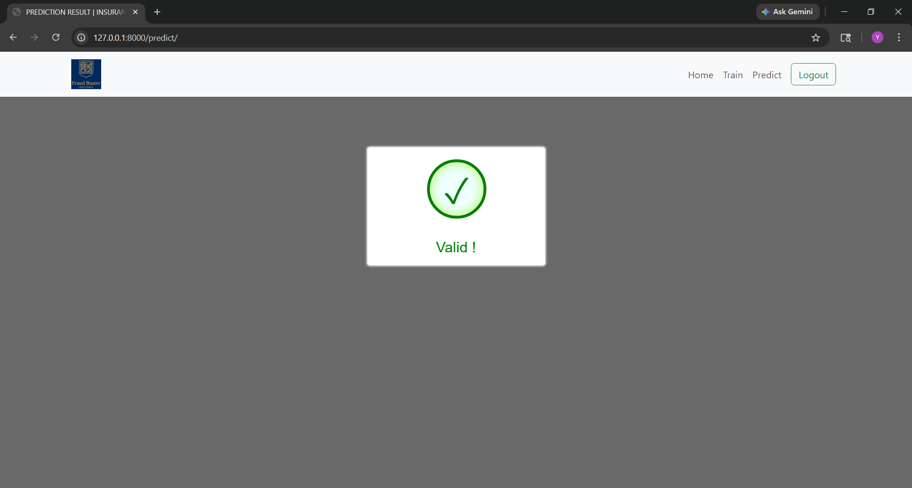

# 🛡️ Insurance Fraud Detection System

A **Machine Learning powered web application** that predicts fraudulent insurance claims using **Logistic Regression**.  
Built using **Django, Scikit-learn, Pandas, MySQL**, and visualization libraries.

---

## 🚀 Features

### 1️⃣ Claim Submission Interface
- User-friendly Django form
- Input validation
- Stores claim details in MySQL

### 2️⃣ Fraud Prediction Model
- Logistic Regression classifier
- Predicts fraud probability
- Real-time prediction result

### 3️⃣ Exploratory Data Analysis (EDA)
- Fraud vs Legitimate claim distribution
- Feature correlation analysis
- Data preprocessing & cleaning

### 4️⃣ Visualization Dashboard
- Count plots
- Correlation heatmaps
- ROC curve
- Fraud probability charts

### 5️⃣ Model Evaluation Metrics
- Accuracy
- Precision
- Recall
- F1 Score
- ROC-AUC Score

---

## 🧠 Tech Stack

| Category | Technology |
|---------|------------|
| Language | Python |
| Framework | Django |
| ML | Scikit-learn |
| Data Analysis | Pandas, NumPy |
| Visualization | Matplotlib, Seaborn |
| Database | MySQL |

---

## 📊 Model Performance

| Metric | Score |
|--------|------|
| Accuracy | 75% |
| Precision | Good |
| Recall | Balanced |
| F1 Score | Optimized |
| ROC-AUC | Strong |

---

## 🏗️ Project Architecture

```
[ User Input ]
        →
[ Django Backend ]
        →
[ Data Preprocessing ]
        →
[ Logistic Regression Model ]
        →
[ Fraud Prediction ]
        →
[ MySQL Database ]
        →
[ Visualization Dashboard ]

```

## 📸 Screenshots

### Home Page


### Login Page


### Train Form Page


### Prediction Page



## Result Validation Page



---

## 📂 Project Structure
```
Insurance_Fraud_Buster
│
├── fraud_detection_app
│   ├── models.py
│   ├── views.py
│   ├── forms.py
│   └── urls.py
│
├── ml_model
│   ├── train_model.ipynb
│   ├── preprocessing.py
│   └── model.pkl
│
├── templates
│   ├── claim_form.html
│   └── result.html
│
├── static
│   ├── css
│   └── images
│
├── db.sqlite3
├── insuranceFraud.csv
├── requirements.txt
├── manage.py
└── README.md
```


## 🔮 Future Improvements
- Random Forest / XGBoost model
- SHAP explainability
- REST API integration
- User authentication
- Deploy on AWS / Render
- Real-time dashboard

## 🎯 Use Cases
- Insurance companies
- Risk assessment teams
- Fraud investigation departments
- Financial analytics teams
